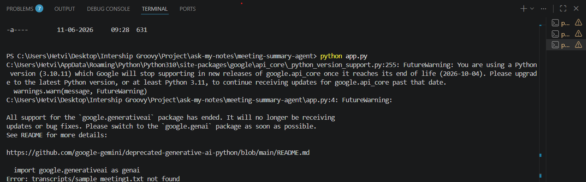
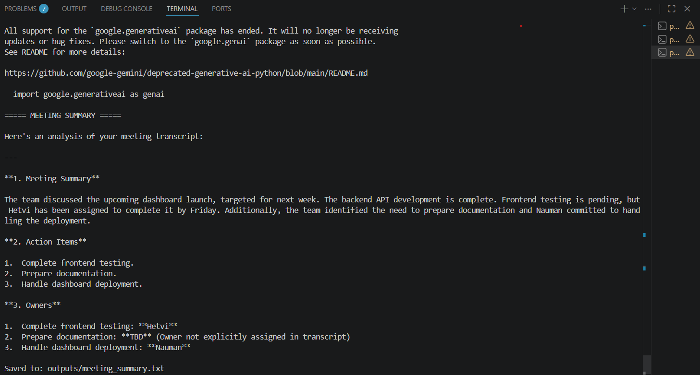
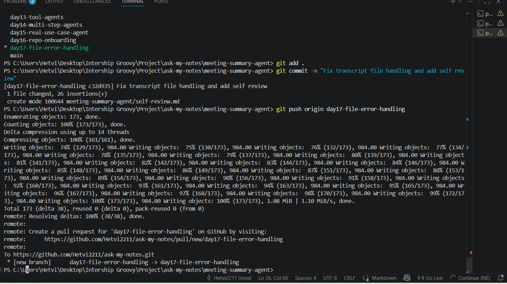
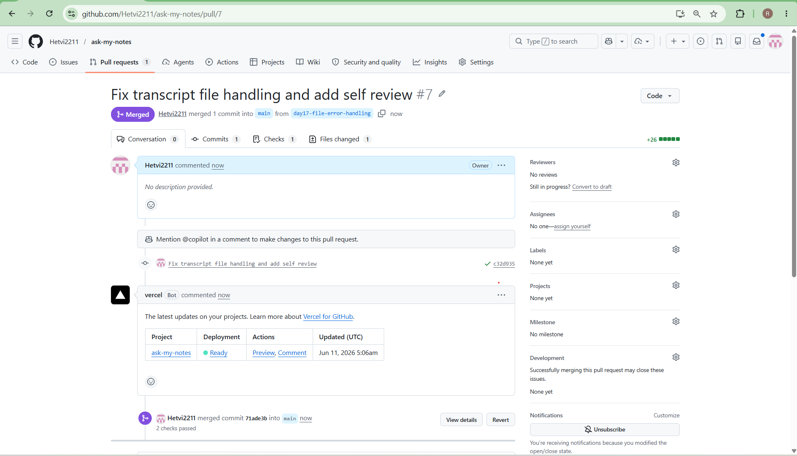

## Day 17 - First Pull Request

Implemented file error handling improvement.

### Fix

Added FileNotFoundError handling in read_transcript().

## Screenshots

### Bug

### Bug-fixed

### Git commit

### Pull-Request

---

### Outcome

Application now provides meaningful feedback instead of crashing.

### PR

Created PR for review and merge.
