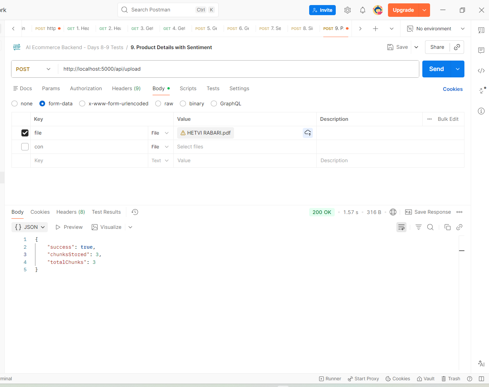
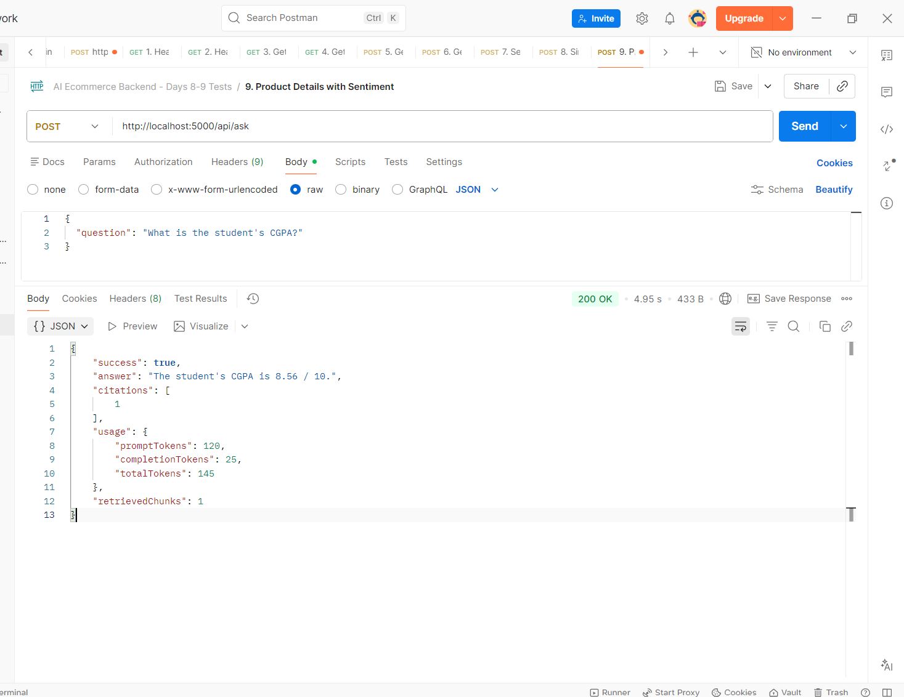
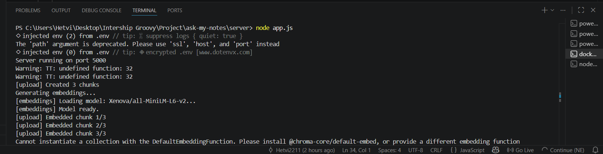
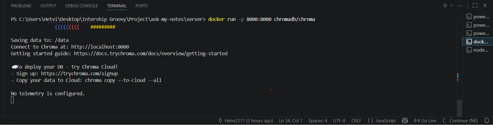

# 📄 Ask My Notes — RAG Powered PDF Q&A

AI-powered PDF Question Answering application that allows users to upload PDF documents and ask natural language questions about their content.

Built using **React, Node.js, Express, Gemini AI, Embeddings, and ChromaDB**.

---

# 🚀 Project Overview

Ask My Notes helps users interact with PDF documents through a conversational interface.

Instead of manually searching through long documents, users can:

✅ Upload a PDF

✅ Extract text automatically

✅ Ask questions in natural language

✅ Get AI-generated answers

✅ View source citations

✅ Perform semantic search using embeddings

✅ Reduce token usage with RAG architecture

✅ Track token usage and telemetry

---

# ✨ Features

### 📤 PDF Upload

* Upload PDF documents directly from the browser
* Drag & Drop support
* File validation
* Automatic text extraction

---

### 🤖 AI-Powered Q&A

* Ask questions about uploaded documents
* Context-aware responses
* Gemini API integration
* Fallback mode when API quota is unavailable

---

### 📚 Citations

* Shows document references
* Improves answer reliability
* Makes responses traceable

---

### 📊 Usage Analytics

* Prompt token tracking
* Completion token tracking
* Total token usage

---

### 🧠 RAG (Retrieval-Augmented Generation)

* PDF content is split into semantic chunks
* Embeddings generated using all-MiniLM-L6-v2
* ChromaDB used as a vector database
* Top relevant chunks retrieved using similarity search
* Reduced token usage compared to full-document prompting

---

### 🔍 Semantic Search

* User questions converted into embeddings
* Similar chunks retrieved from ChromaDB
* Context passed to Gemini for accurate answers
* Improves scalability for large documents

---

### 🎨 Modern UI

* Dark theme interface
* Responsive design
* Loading states
* Error handling
* Professional dashboard layout

---

# 🏗️ Tech Stack

## Frontend

* React
* Vite
* Axios

## Backend

* Node.js
* Express.js
* Multer
* PDF Parse

## AI & RAG

* Gemini API
* Transformers.js
* all-MiniLM-L6-v2 Embedding Model

## Vector Database

* ChromaDB

---

# 📁 Project Structure

```text
ask-my-notes
│
├── client
│   ├── src
│   │   ├── App.jsx
│   │   ├── main.jsx
│   │   └── index.css
│   │
│   └── package.json
│
├── server
│   ├── routes
│   │   ├── upload.js
│   │   └── ask.js
│   │
│   ├── services
│   │   ├── geminiService.js
│   │   ├── embeddingService.js
│   │   ├── chromaStore.js
│   │   └── documentStore.js
│   │
│   ├── app.js
│   └── package.json
│
├── day11-evidence
│
├── screenshots
│
├── README.md
└── .gitignore
```

---

# ⚙️ Installation

## Clone Repository

```bash
git clone https://github.com/YOUR_USERNAME/ask-my-notes.git

cd ask-my-notes
```

---

## Backend Setup

```bash
cd server

npm install

node app.js
```

Backend runs on:

```text
http://localhost:5000
```

---

## ChromaDB Setup

Run ChromaDB locally using Docker:

```bash
docker run -p 8000:8000 chromadb/chroma
```

ChromaDB runs on:

```text
http://localhost:8000
```

This project stores document embeddings inside a ChromaDB collection and retrieves relevant chunks using vector similarity search.

---

## Frontend Setup

```bash
cd client

npm install

npm run dev
```

Frontend runs on:

```text
http://localhost:5173
```

---

# 🔑 Environment Variables

Create:

```text
server/.env
```

Add:

```env
GEMINI_API_KEY=your_api_key_here
```

---

# 📡 API Endpoints

## Upload PDF

```http
POST /api/upload
```

### Request

```form-data
file : pdf
```

### Response

```json
{
  "success": true,
  "chunksStored": 3,
  "totalChunks": 3
}
```

---

## Ask Question

```http
POST /api/ask
```

### Request

```json
{
  "question": "What is the student's CGPA?"
}
```

### Response

```json
{
  "success": true,
  "answer": "The student's CGPA is 8.56 / 10.",
  "citations": [1],
  "retrievedChunks": 2,
  "usage": {
    "promptTokens": 120,
    "completionTokens": 30,
    "totalTokens": 150
  }
}
```

---

# 🔄 RAG Application Flow

```text
User Uploads PDF
        │
        ▼
PDF Text Extraction
        │
        ▼
Chunking (1000 chars + overlap)
        │
        ▼
Generate Embeddings
        │
        ▼
Store Vectors in ChromaDB
        │
        ▼
User Asks Question
        │
        ▼
Question Embedding
        │
        ▼
Retrieve Top-K Similar Chunks
        │
        ▼
Gemini Receives Context
        │
        ▼
Generate Answer + Citations
```

---

# 📈 Full Document vs RAG

| Approach         | Tokens Sent | Cost  | Accuracy              |
| ---------------- | ----------- | ----- | --------------------- |
| Full Document QA | High        | High  | Good                  |
| RAG-Based QA     | Low         | Lower | Better for large PDFs |

---

### Why RAG?

Instead of sending the entire PDF to Gemini, the application retrieves only the most relevant chunks using vector similarity search.

Benefits:

* Lower token usage
* Reduced API cost
* Faster responses
* Better scalability
* Improved retrieval accuracy

---

# 🖼️ Screenshots

## Home Screen


---

## PDF Upload Success



---

## Ask Question API



---

## Backend Logs



---

## ChromaDB Running




---

# 📂 Day 11 Evidence

Include screenshots of:

---

## 1. ChromaDB Running

Terminal showing:

```bash
docker run -p 8000:8000 chromadb/chroma
```

and:

```text
Connect to Chroma at: http://localhost:8000
```

---

## 2. Upload API Success

```json
{
  "success": true,
  "chunksStored": 3,
  "totalChunks": 3
}
```

---

## 3. Backend Logs

```text
[upload] Created 3 chunks
[upload] Embedded chunk 1/3
[upload] Embedded chunk 2/3
[upload] Embedded chunk 3/3
[ChromaDB] Saved 3 chunks
```

---

## 4. Ask API Success

```json
{
  "success": true,
  "answer": "...",
  "citations": [1],
  "retrievedChunks": 2
}
```

---

## 5. README Screenshot

Take a screenshot of the updated README and place it inside the evidence folder.

---

# 🎯 Learning Outcomes

Through this project I learned:

* PDF processing using Node.js
* File uploads with Multer
* REST API development
* Gemini API integration
* Embedding generation
* Vector databases (ChromaDB)
* Semantic search
* Cosine similarity
* Retrieval-Augmented Generation (RAG)
* Prompt engineering
* Token optimization strategies
* Building production-style AI applications

---

# 🚀 Future Improvements

* Multi-document RAG
* User authentication
* Chat history
* Document summarization
* Hybrid search (keyword + vector)
* Cloud-hosted vector database
* Streaming responses
* Document collections
* Role-based access control

---

# ✅ Day 11 Deliverable Completed

This version upgrades the original PDF Q&A application into a production-style RAG pipeline using:

* Embeddings
* Semantic Search
* Vector Databases
* ChromaDB
* Retrieval-Augmented Generation (RAG)

The application now retrieves only the most relevant chunks before generating answers, reducing token usage and improving scalability for large PDFs.
