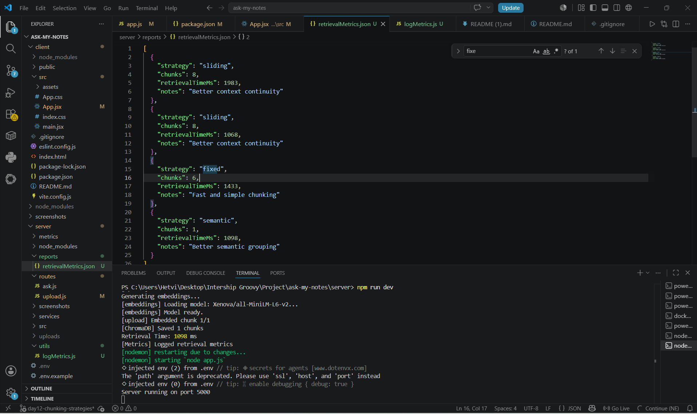
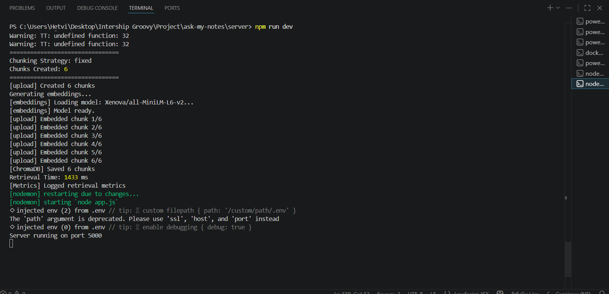
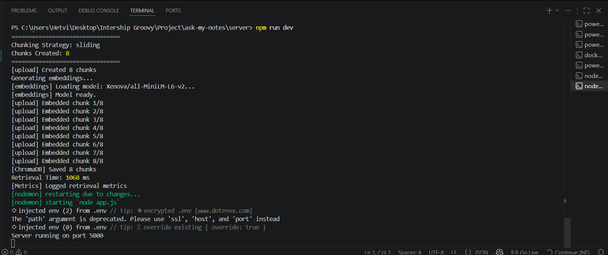
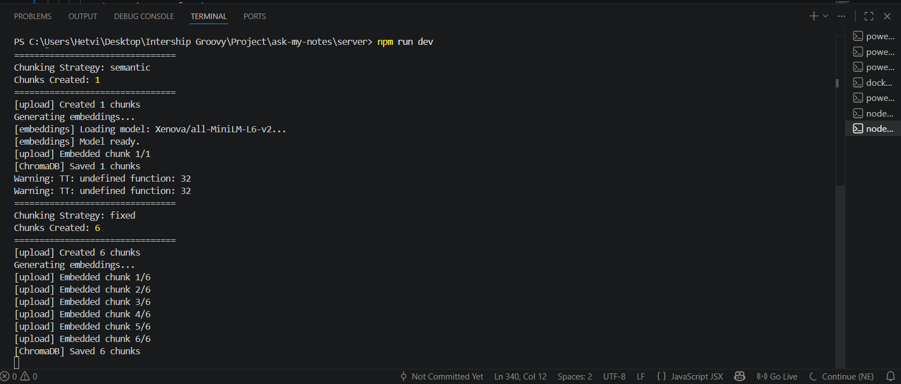
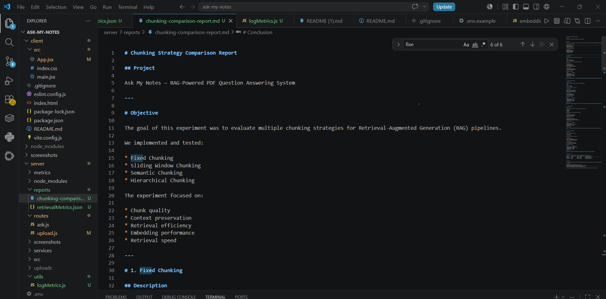
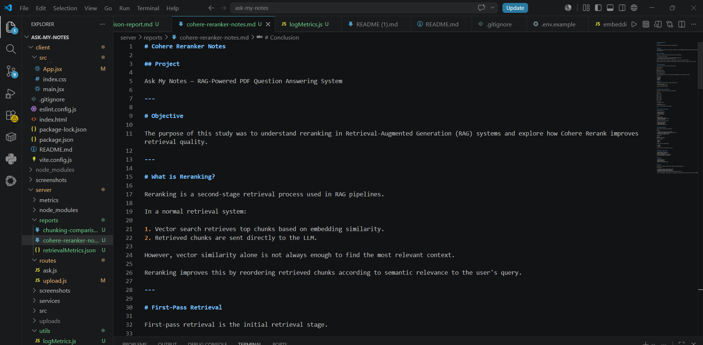

# Ask My Notes — Day 12

## Chunking + Retrieval Strategies in RAG

AI-powered PDF Question Answering system with multiple chunking strategies, retrieval experimentation, embeddings, and vector search using ChromaDB.

---

# 🚀 Day 12 Objectives

This implementation focuses on:

* Fixed Chunking
* Sliding Window Chunking
* Semantic Chunking
* Hierarchical Chunking
* Retrieval experimentation
* Retrieval metrics logging
* Chunking strategy comparison
* Cohere reranker research

---

# 🧠 What is Chunking?

Chunking is the process of splitting large documents into smaller pieces before generating embeddings.

Good chunking improves:

* retrieval quality
* context preservation
* answer accuracy
* RAG performance

---

# 📂 Project Structure

```bash
server/
│
├── src/
│   └── chunking/
│       ├── fixedChunking.js
│       ├── slidingWindowChunking.js
│       ├── semanticChunking.js
│       ├── hierarchicalChunking.js
│       └── index.js
│
├── reports/
│   ├── chunking-comparison-report.md
│   ├── retrievalMetrics.json
│   └── cohere-reranker-notes.md
│
├── screenshots/
│   ├── retrieval-fixed.png
│   ├── retrieval-sliding.png
│   ├── retrieval-semantic.png
│   ├── metrics-json.png
│   ├── chunking-report.png
│   └── cohere-reranker-notes.png
│
├── routes/
│   └── upload.js
│
├── services/
│   ├── chromaStore.js
│   ├── embeddingService.js
│   └── documentStore.js
│
├── app.js
└── package.json
```

---

# ⚡ Implemented Chunking Strategies

## 1. Fixed Chunking

Splits text into equal-sized chunks.

Example:

```txt
0–500
450–950
900–1400
```

### Features

* Simple
* Fast
* Predictable chunk sizes

---

## 2. Sliding Window Chunking

Uses larger overlap between chunks to preserve context continuity.

Example:

```txt
Chunk 1 → 0–500
Chunk 2 → 300–800
```

### Features

* Better context retention
* Improved answer consistency

---

## 3. Semantic Chunking

Splits text based on:

* paragraphs
* headings
* semantic boundaries

### Features

* Natural chunk boundaries
* Better semantic understanding

---

## 4. Hierarchical Chunking

Creates:

* parent chunks
* child chunks

### Features

* Multi-level retrieval
* Better large-document organization

---

# 🔄 Retrieval Pipeline

```txt
PDF Upload
    ↓
PDF Text Extraction
    ↓
Selected Chunking Strategy
    ↓
Embeddings Generation
    ↓
ChromaDB Vector Storage
    ↓
Similarity Search
    ↓
LLM Response
```

---

# 🛠️ Dynamic Chunking Strategy Selection

The upload API supports dynamic chunking strategies.

Examples:

```bash
http://localhost:5000/api/upload?strategy=fixed
```

```bash
http://localhost:5000/api/upload?strategy=sliding
```

```bash
http://localhost:5000/api/upload?strategy=semantic
```

```bash
http://localhost:5000/api/upload?strategy=hierarchical
```

---

# 📊 Retrieval Metrics

The system logs:

* chunk count
* retrieval time
* strategy used
* answer quality observations

Metrics are stored in:

```bash
reports/retrievalMetrics.json
```

---

# 📈 Chunking Experiment Results

| Strategy     | Chunks Created | Context Quality | Speed  | Embedding Cost |
| ------------ | -------------- | --------------- | ------ | -------------- |
| Fixed        | 6              | Medium          | Fast   | Medium         |
| Sliding      | 8              | High            | Medium | High           |
| Semantic     | 1              | High            | Fast   | Low            |
| Hierarchical | Experimental   | High            | Medium | Medium         |

---

# 🧪 Cohere Reranker Research

Studied:

* first-pass retrieval
* second-pass retrieval
* reranking
* Cohere Rerank pipeline

Documented in:

```bash
reports/cohere-reranker-notes.md
```

---

# 📸 Screenshots

## Retrieval Metrics



## Fixed Chunking



## Sliding Window Chunking



## Semantic Chunking



## Chunking Comparison Report



## Cohere Reranker Notes



---

# 🧠 Technologies Used

* Node.js
* Express.js
* ChromaDB
* Xenova Transformers
* PDF Parse
* React.js
* Gemini API
* Embeddings
* RAG Pipeline

---

# 🚀 Installation

## Clone Repository

```bash
git clone <your-repo-url>
```

---

## Install Backend Dependencies

```bash
cd server
npm install
```

---

## Install Frontend Dependencies

```bash
cd client
npm install
```

---

# ▶️ Run Backend

```bash
cd server
npm run dev
```

---

# ▶️ Run Frontend

```bash
cd client
npm run dev
```

---

# 🧪 Testing Chunking Strategies

Upload PDFs using different strategies:

## Fixed

```bash
http://localhost:5000/api/upload?strategy=fixed
```

## Sliding

```bash
http://localhost:5000/api/upload?strategy=sliding
```

## Semantic

```bash
http://localhost:5000/api/upload?strategy=semantic
```

---

# ✅ Day 12 Deliverables Completed

* ✅ Implemented 4 chunking strategies
* ✅ Dynamic strategy selector
* ✅ Retrieval experimentation
* ✅ Retrieval metrics logging
* ✅ Chunking comparison report
* ✅ Cohere reranker research
* ✅ Updated README
* ✅ Screenshots documentation

---

# 📚 Key Learnings

* Chunking significantly affects RAG quality
* Sliding window preserves context effectively
* Semantic chunking improves natural retrieval
* Retrieval evaluation is critical in production RAG systems
* Reranking improves second-pass retrieval quality
