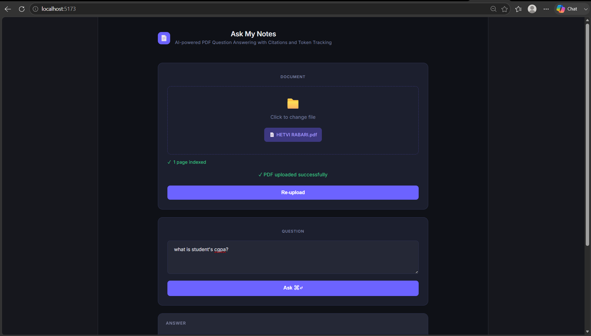
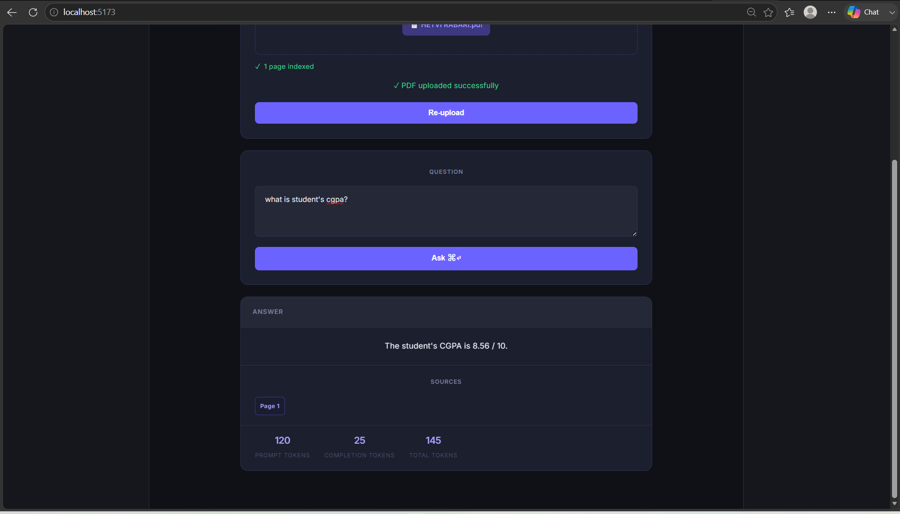
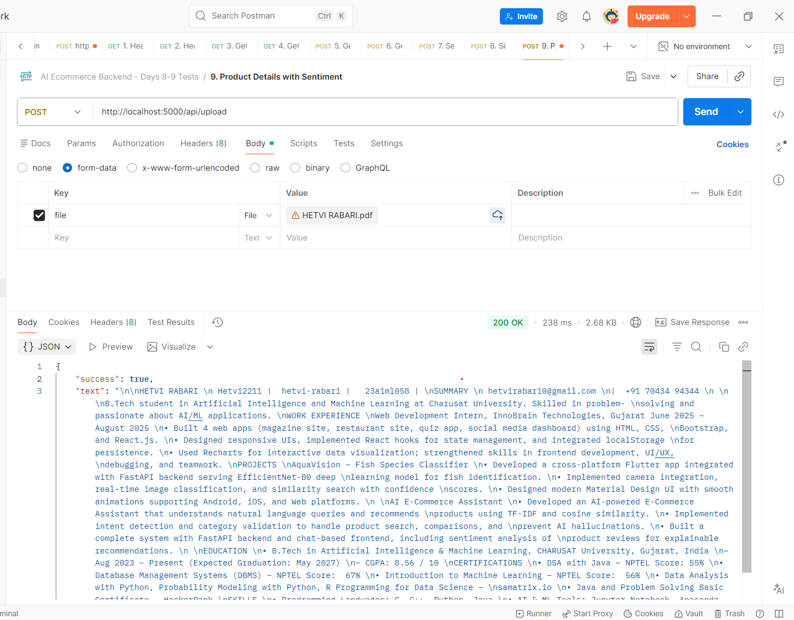
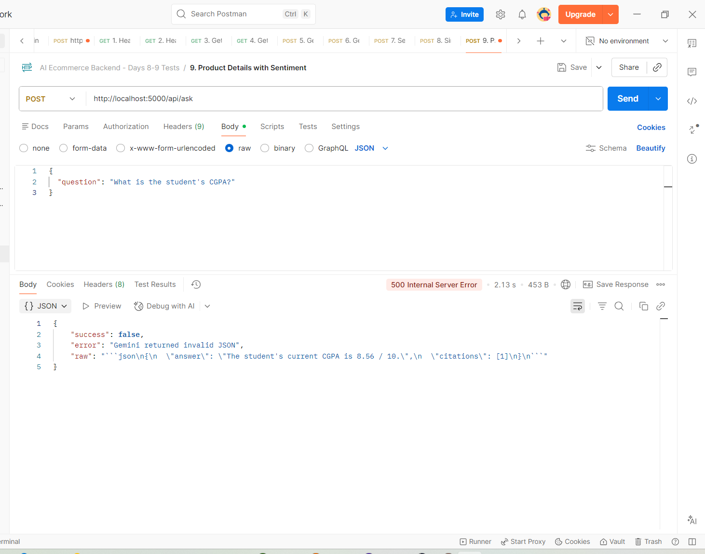

# 📄 Ask My Notes

AI-powered PDF Question Answering application that allows users to upload PDF documents and ask natural language questions about their content.

Built using **React, Node.js, Express, PDF Parse, and Gemini AI**.

---

## 🚀 Project Overview

Ask My Notes helps users interact with PDF documents through a conversational interface.

Instead of manually searching through long documents, users can:

✅ Upload a PDF

✅ Extract text automatically

✅ Ask questions in natural language

✅ Get AI-generated answers

✅ View source citations

✅ Track token usage and telemetry

---

## ✨ Features

### 📤 PDF Upload

* Upload PDF documents directly from the browser
* Drag & Drop support
* File validation
* Automatic text extraction

### 🤖 AI-Powered Q&A

* Ask questions about uploaded documents
* Context-aware responses
* Gemini API integration
* Fallback mode when API quota is unavailable

### 📚 Citations

* Shows document page references
* Improves answer reliability
* Makes responses traceable

### 📊 Usage Analytics

* Prompt token tracking
* Completion token tracking
* Total token usage

### 🎨 Modern UI

* Dark theme interface
* Responsive design
* Loading states
* Error handling
* Professional dashboard layout

---

# 🏗️ Tech Stack

## Frontend

* React
* Vite
* Axios

## Backend

* Node.js
* Express.js
* Multer
* PDF Parse

## AI Integration

* Gemini API

---

# 📁 Project Structure

```text
ask-my-notes
│
├── client
│   ├── src
│   │   ├── App.jsx
│   │   ├── main.jsx
│   │   └── index.css
│   │
│   └── package.json
│
├── server
│   ├── routes
│   │   ├── upload.js
│   │   └── ask.js
│   │
│   ├── services
│   │   ├── geminiService.js
│   │   └── documentStore.js
│   │
│   ├── app.js
│   └── package.json
│
├── screenshots
│
├── README.md
└── .gitignore
```

---

# ⚙️ Installation

## Clone Repository

```bash
git clone https://github.com/YOUR_USERNAME/ask-my-notes.git

cd ask-my-notes
```

---

## Backend Setup

```bash
cd server

npm install

node app.js
```

Backend runs on:

```text
http://localhost:5000
```

---

## Frontend Setup

```bash
cd client

npm install

npm run dev
```

Frontend runs on:

```text
http://localhost:5173
```

---

# 🔑 Environment Variables

Create:

```text
server/.env
```

Add:

```env
GEMINI_API_KEY=your_api_key_here
```

---

# 📡 API Endpoints

## Upload PDF

```http
POST /api/upload
```

### Request

```form-data
file : pdf
```

### Response

```json
{
  "success": true
}
```

---

## Ask Question

```http
POST /api/ask
```

### Request

```json
{
  "question": "What is the student's CGPA?"
}
```

### Response

```json
{
  "success": true,
  "answer": "The student's CGPA is 8.56 / 10.",
  "citations": [1],
  "usage": {
    "promptTokens": 120,
    "completionTokens": 30,
    "totalTokens": 150
  }
}
```

---

# 🖼️ Screenshots

## Home Screen



---

## Ask Question-Answer



---

## Postman Testing




---

# 🔄 Application Flow

```text
User Uploads PDF
        │
        ▼
PDF Text Extraction
        │
        ▼
Store Document Content
        │
        ▼
User Asks Question
        │
        ▼
Gemini API Processing
        │
        ▼
Generate Answer
        │
        ▼
Return Citations + Token Usage
```

---

# 🎯 Learning Outcomes

Through this project I learned:

* PDF processing using Node.js
* File uploads with Multer
* REST API development
* Gemini API integration
* Prompt engineering
* React state management
* Error handling strategies
* Token usage tracking
* Building AI-powered applications

---

# 🚀 Future Improvements

* Vector Database Integration
* Semantic Search
* RAG Architecture
* Multi-document Support
* Authentication & Authorization
* Chat History
* Document Summarization
* Cloud Storage Integration

---

# 👩‍💻 Author

**Hetvi Rabari**

B.Tech Artificial Intelligence & Machine Learning

CHARUSAT University

GitHub: https://github.com/YOUR_USERNAME

LinkedIn: https://linkedin.com/in/YOUR_PROFILE
