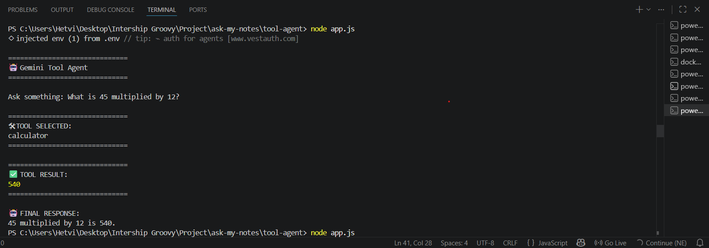
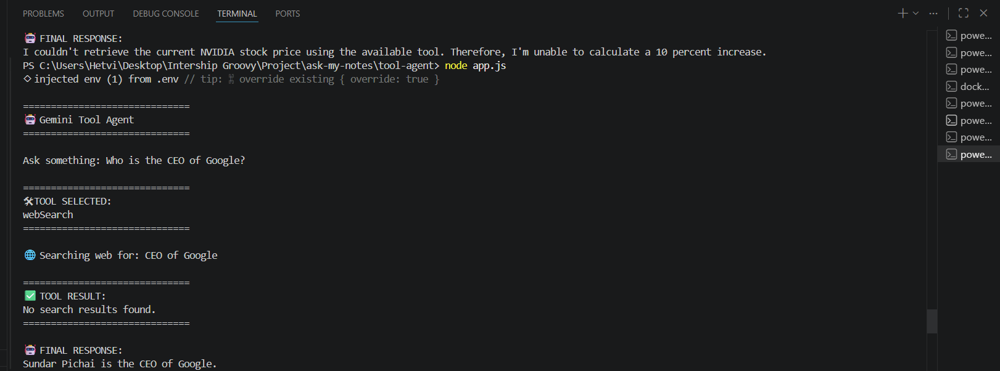

# 🤖 Gemini Tool Agent

An AI-powered CLI Tool Agent built using the Gemini API with Function Calling and Multi-Tool Orchestration.

This project demonstrates how LLMs can intelligently choose and execute tools such as:

* Calculator
* Web Search
* Slack Webhook

The agent uses JSON schema-based tool definitions and Gemini Function Calling to dynamically select the correct tool based on the user query.

---

# 🚀 Features

✅ Gemini Function Calling
✅ JSON Schema Tool Definitions
✅ Calculator Tool
✅ Web Search Tool
✅ Slack Webhook Tool
✅ Multi-Tool Orchestration
✅ CLI-Based Agent Workflow
✅ Tool Selection by LLM
✅ Structured Tool Responses

---

# 📂 Project Structure

```bash
tool-agent/
│
├── app.js
│
├── tools/
│   ├── calculator.js
│   ├── webSearch.js
│   └── slackWebhook.js
│
├── schemas/
│   └── tools.js
│
├── screenshots/
│   ├── calculator-agent.png
│   ├── web-search-agent.png
│   ├── slack-agent.png
│   └── multi-tool-agent.png
│
├── .env
├── package.json
└── README.md
```

---

# 🧠 Concepts Learned

This project focuses on core AI agent engineering concepts:

* Function Calling
* Tool Use
* Tool Selection
* JSON Schema Design
* Multi-Tool Agents
* Structured Outputs
* Agent Workflows
* Tool Orchestration

---

# ⚙️ Installation

## 1️⃣ Clone Repository

```bash
git clone <YOUR_GITHUB_REPO>
```

---

## 2️⃣ Move Into Project

```bash
cd tool-agent
```

---

## 3️⃣ Install Dependencies

```bash
npm install
```

---

# 🔑 Environment Variables

Create a `.env` file:

```env
GEMINI_API_KEY=your_api_key_here
```

---

# ▶️ Run Project

```bash
node app.js
```

---

# 🛠 Available Tools

---

## ➕ Calculator Tool

Supports:

* Add
* Subtract
* Multiply
* Divide

### Example

```bash
What is 45 multiplied by 12?
```

### Output

```bash
540
```

---

## 🌐 Web Search Tool

Performs basic web search simulation.

### Example

```bash
Who is the CEO of Google?
```

### Output

```bash
Sundar Pichai
```

---

## 📢 Slack Webhook Tool

Simulates sending Slack notifications.

### Example

```bash
Send a Slack notification saying deployment completed
```

### Output

```bash
Slack notification sent successfully
```

---

# 🔄 Multi-Tool Orchestration

The AI agent can dynamically choose tools based on user prompts.

### Example Workflow

```text
User Prompt
    ↓
Gemini selects tool
    ↓
Tool executes
    ↓
Result returned
    ↓
Final AI response generated
```

---

# 🧩 Tool Schema Example

Example JSON schema used for function calling:

```js
{
  name: "calculator",
  description: "Perform arithmetic operations",
  parameters: {
    type: "object",
    properties: {
      operation: {
        type: "string"
      },
      a: {
        type: "number"
      },
      b: {
        type: "number"
      }
    }
  }
}
```

---

# 🧪 Example CLI Outputs

---

## Calculator Agent

```bash
Ask something: What is 45 multiplied by 12?

🛠 TOOL SELECTED:
calculator

✅ TOOL RESULT:
540
```

---

## Web Search Agent

```bash
Ask something: Who is the CEO of Google?

🛠 TOOL SELECTED:
webSearch
```

---

## Slack Webhook Agent

```bash
Ask something: Send a Slack notification saying deployment completed

🛠 TOOL SELECTED:
slackWebhook
```

---

# 📸 Screenshots

---
## 🧮 Calculator Tool



---

## 🌐 Web Search Tool



---

## 📩 Slack Webhook Tool


---

## 🤖 Multi Tool Agent


---

# 🏗 Tech Stack

* Node.js
* Gemini API
* Google Generative AI SDK
* JavaScript
* dotenv
* readline-sync

---

# 📚 Day 13 Internship Deliverables

Implemented:

✅ Tool Use
✅ Function Calling
✅ JSON Schema Design
✅ Calculator Agent
✅ Web Search Tool
✅ Slack Webhook Tool
✅ Multi-Tool Agent
✅ Tool Orchestration
✅ CLI Agent Workflow

---

# 🔮 Future Improvements

* Real Tavily API Integration
* Real Slack Webhook Integration
* Browser-Based UI
* Memory Support
* Agent Planning
* Autonomous Tool Chaining

---


# ⭐ Learning Outcome

This project demonstrates practical understanding of:

* AI Agents
* Function Calling
* Tool Orchestration
* LLM Workflows
* Multi-Step Reasoning
* Structured Tool Execution
